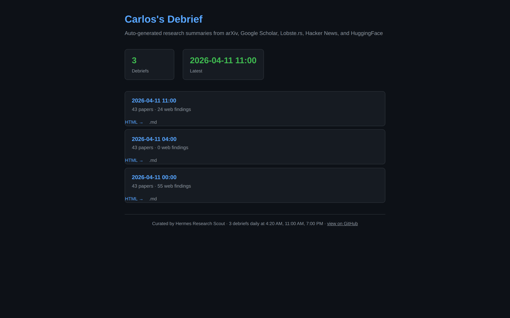
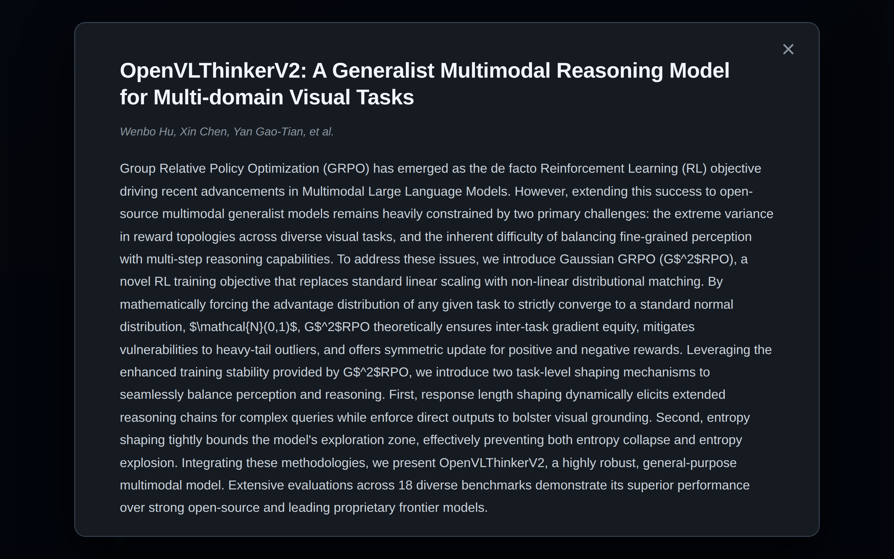
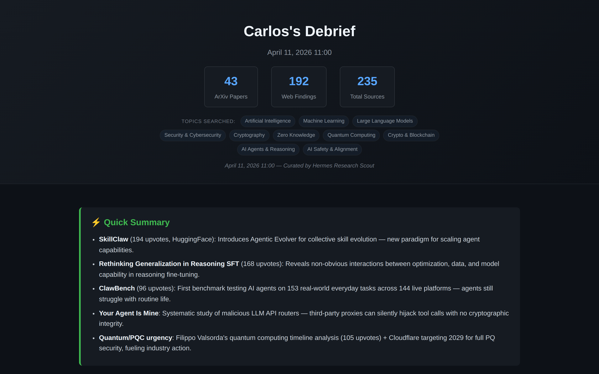

# Carlos's Debrief

> Auto-generated AI research debriefs from arXiv, HuggingFace, Lobste.rs, Hacker News, and Google Scholar — published three times a day to a static site you can read in a browser.

**🔗 Live: [claudlos.github.io/carlos-debrief](https://claudlos.github.io/carlos-debrief/)**



## What it is

A pipeline that scouts the web for new AI / ML / security / crypto research three times a day, deduplicates against everything it has ever surfaced before, hands the harvest to an LLM to compile into a digest, and publishes the result as a self-contained dark-themed HTML page on GitHub Pages.

The goal is to **not have to open ten tabs** every morning. Click any card to zoom in and read the full abstract without leaving the page.

## Features

- **📰 Two summary boxes** at the top of every debrief: one for arXiv research highlights, one for trending news headlines.
- **🔍 Click-to-zoom modal** — click any paper or news card to read the full abstract in a large reading view (90vw, ~21px font). `←` / `→` to navigate, `Esc` to close.
- **🔎 In-page search filter** — type to instantly filter all cards across every section by title, authors, or tags.
- **🔁 Persistent dedup** — every paper/article ID and title hash is recorded forever, so the same paper never appears in two debriefs.
- **📚 Full abstracts** — every arXiv card embeds the full untruncated abstract; web cards embed the article's `<meta description>` or first paragraph.
- **🌑 Dark theme**, mobile responsive, fully self-contained HTML (no external CSS or JS).



## Sources

| Source | Method | What it's good for |
| --- | --- | --- |
| **arXiv** | REST API | Daily fresh papers across 10 topic searches |
| **HuggingFace daily papers** | JSON API | Curated trending ML papers, with upvotes and full abstracts |
| **Lobste.rs** | JSON API (`/t/{tag}.json`) | High-signal infosec / compsci link aggregator |
| **Hacker News** | Algolia search | Tech news front-page conversations |
| **Google Scholar** | camoufox scrape | Citation-based discovery for general topics |

### Topics searched

Artificial Intelligence · Machine Learning · Large Language Models · Security & Cybersecurity · Cryptography · Zero Knowledge · Quantum Computing · Crypto & Blockchain · AI Agents & Reasoning · AI Safety & Alignment

## Schedule

Three debriefs per day, all auto-published:

| Time (CT) | Debrief |
| --- | --- |
| **04:20 AM** | Overnight wrap |
| **11:00 AM** | Morning highlights |
| **07:00 PM** | Evening edition |

Each run executes the scouts, generates `.md` and `.html` artifacts, updates the dashboard manifest, and pushes to this repo. GitHub Pages rebuilds within ~30 seconds.

## How it works

```
[ Hermes cron, 3x/day ]
        │
        ▼
┌──────────────────────────────────────────────┐
│ 0. Scouts (only run here, never separately)  │
│    - fetch_papers.py     (arXiv API)         │
│    - api_scout.py        (Lobste.rs + HF)    │
│    - web_scout.py        (camoufox: GS + HN) │
│    All three dedup against seen_*.txt        │
└──────────────────────────────────────────────┘
        │  papers.jsonl + web_papers.jsonl
        ▼
┌──────────────────────────────────────────────┐
│ 1-6. Hermes LLM compiles the debrief         │
│      Reads template.html as the source       │
│      of truth for CSS / modal / search JS    │
└──────────────────────────────────────────────┘
        │  debrief-YYYY-MM-DD-HH.{html,md}
        ▼
┌──────────────────────────────────────────────┐
│ 7. git add / commit / push origin main       │
└──────────────────────────────────────────────┘
        │
        ▼
   GitHub Pages rebuilds → live in ~30s
```

The scouts maintain `seen_arxiv_ids.txt` and `seen_web_keys.txt` so even after the per-debrief queue files are cleared, the same paper will not surface in a future debrief.



## Repo layout

```
.
├── index.html                  # dashboard, fetches manifest.json client-side
├── manifest.json               # list of every debrief, newest first
├── template.html               # canonical template — CSS, modal, search JS
├── debrief-YYYY-MM-DD-HH.html  # generated debrief pages
├── debrief-YYYY-MM-DD-HH.md    # markdown version of each debrief
└── assets/                     # screenshots used by this README
```

The scout scripts and cron config live outside the repo (in the local Hermes setup) and aren't checked in.

## Reading a debrief

- Click anywhere on a card to zoom into the modal view.
- Use the search box at the top to filter cards by keyword (title, authors, tags, full abstract text).
- Click the paper title link to open the source on arXiv / Lobste.rs / wherever.
- `←` / `→` keys navigate between cards inside the modal.
- `Esc` closes the modal.
